 
 

 

## **1. Presentación de mi tesis de bachillerato**

 La presente tesis trata sobre el desarrollo de una aplicación informática para el cálculo de los principales componentes que constituyen a un sistema de transmisión de potencia mecánico. Especificamente, la aplicación permite calcular transmisiones por correas planas, correas trapezoidales, cadenas y engranajes, considerando a los ejes de transmisión como el componente principal del sistema. En base a lo último antes mencionado, esque se ha puesto mayor enfasis en el desarrollo de la metodología de cálculo de los ejes de transmisión de potencia, considerando para ello, diversas teorías y modelos matemáticos existentes para dicho fin. No obstante, cabe señalar que, para el caso de los demas componentes, se ha optimizado el procedimiento de cálculo mediante el uso, principalmente, del procesamiento de imagenes. Gracias a la mejora constante en los algoritmos de cálculo, al desarrollo de una interfaz grafica amigable al usuario y que la aplicación desarrollada es facil de compartir, se ha logrado cumplir con los objetivos planteados, los cuales eran optimizar en terminos de tiempo, precisión y eficiencia, el diseño de un sistema de transmisión de potencia mecánico y, el promover y facilitar el uso de las herramientas informáticas actuales, en las actividades cotidianas de un estudiante o profesional de la carrera de ingeniería mecánica. 

 
 
 

 

## **2. Diferencias respecto a proyectos similares**

### **2.1 Digitalización de diagramas**

 Dado que para el cálculo y diseño de los componentes de un sistema de transmisión de potencia mecánico, resulta indispensable hacer uso de diagramas para determinar ciertos factores de suma importancia, lo cual consume tiempo y precisión, se ha visto por conveniente procesar dichos diagramas, para la obtención rapida y precisa de los señalados factores. Las ecuaciones utilizadas para dicho procesamiento son: 

 

$$
\large x_{n_{a,b}} = \frac{x_{n_{b,a}} - x_{1_{b,a}}}{x_{2_{b,a}} - x_{1_{b,a}}}(x_{2_{a,b}} - x_{1_{a,b}}) + x_{1_{a,b}}
$$

$$
\large y_{n_{a,b}} = \frac{y_{n_{b,a}} - y_{1_{b,a}}}{y_{2_{b,a}} - y_{1_{b,a}}}(y_{2_{a,b}} - y_{1_{a,b}}) + y_{1_{a,b}}
$$

  
Mostrar interactividad

   
  

  
  

 

### **2.2 Configuración geométrica de la transmisión**

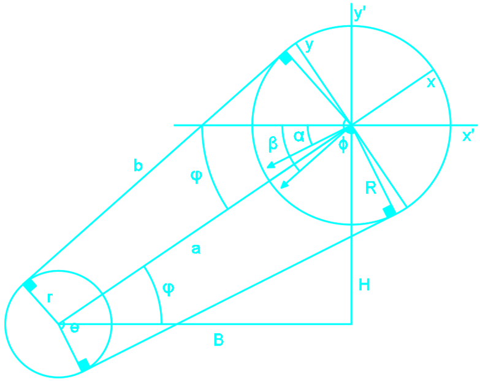

 La desalineación horizontal o vertical entre el eje del motor y el eje de transmisión del sistema resulta relevante al momento de determinar la magnitud, orientación y sentido de las fuerzas que se transmiten al último de los mencionados ejes. Los ángulos de descomposición de las fuerzas de transmisión se calculan con las siguientes expresiones: 

 

$$\large \phi = \arccos\left(\frac{R - r}{a}\right) \quad \varphi = \arccos\left(\frac{B}{a}\right)$$

$$\large \beta  = 90 + \varphi  - \phi \quad \quad \alpha  = 2\varphi  - \beta$$

 
 

Dependiendo del sentido de giro del motor, las fuerzas en los ejes X y Y se cálculan con las siguientes igualdades:

 

$$
\large \text{Giro del motor en sentido antihorario:} \quad \begin{array}{l}
F_{x'} = F_{\max}\cos(\beta) + F_{\min}\cos(\alpha) \\
F_{y'} = F_{\max}\sin(\beta) + F_{\min}\sin(\alpha)
\end{array}
$$

 

$$
\large \text{Giro del motor en sentido horario:} \quad \quad \quad \begin{array}{l}
F_{x'} = F_{\min}\cos(\beta) + F_{\max}\cos(\alpha) \\
F_{y'} = F_{\min}\sin(\beta) + F_{\max}\sin(\alpha)
\end{array}
$$

 

### **2.3 Ejes de transmisión huecos**

 Para el análisis de ejes huecos, se ha considerado el efecto del orificio interior, en las propiedades geométricas del eje de transmisión. Dichas propiedades son: 

 

| Área | Momento polar de inercia | Primer momento de área | Segundo momento de área | Espesor |
|:---:|:---:|:---:|:---:|:---:|
| $$A = \pi (R^2 - r^2)$$ | $$\large J = \frac{\pi (R^4 - r^4)}{2}$$ | $$\large I = \frac{\pi (R^4 - r^4)}{4}$$ | $$\large Q = \frac{2(R^3 - r^3) \sin ^3\alpha}{3}$$ | $$t = 2(R - r)\sin \alpha$$ |

 

### **2.4 Cálculo general de ejes de transmisión**

Mediante el método de las integraciones concecutivas, se hace posible determinar las fuerzas cortantes, momentos flectores, deformaciones angulares y lineales presentes en el eje de transmisión. Las ecuaciones que describen dichos resultados, para cada tramo del eje, se han planteado de la siguiente manera: 

 

Fuerzas cortantes:

$$
\large V_k(x) = - \sum_{i=1}^k F_i - w_i(x - x_i) - \sum_{i=1}^k w_{i-1}(x_i - x_{i-1})
$$

 

Momentos flectores:

$$
\large M_k(x) = -x\sum_{i=1}^k F_i - \frac{1}{2}w_i(x - x_i)^2 - x\sum_{i=1}^k w_{i-1}(x_i - x_{i-1}) + C_{1_i} + M_i
$$

 

Deformaciones angulares:

$$
\large \theta_k(x) = \frac{- \frac{x^2}{2}\sum_{i=1}^k F_i - \frac{1}{6}w_i(x - x_i)^3 - \frac{x^2}{2}\sum_{i=1}^k w_{i-1}(x_i - x_{i-1}) + C_{1_i}x + M_ix + C_{2_i}}{E_iI_i}
$$

 

Deformaciones lineales:

$$
\large y_k(x) = \frac{- \frac{x^3}{6}\sum_{i=1}^k F_i - \frac{1}{24}w_i(x - x_i)^4 - \frac{x^3}{6}\sum_{i=1}^k w_{i-1}(x_i - x_{i-1}) + \frac{C_{1_i}x^2}{2} + \frac{M_ix^2}{2} + C_{2_i}x + C_{3_i}}{E_iI_i}
$$

 

 Para k = 1 → T, donde T es el numero de tramos del eje de transmisión. Aplicando las condiciones de frontera correspondientes en dichas ecuaciones y considerando ademas a las ecuaciones referidas al equilibrio estático, siempre sera posible cálcular todas las incognitas presentes en el sistema de ecuaciones formulado. Esto significa que, sin importar el número de apoyos y cargas presentes en el eje de transmisión o sus propiedades, este se podra cálcular sin problemas. 

 

### **2.5 Fuerzas cortantes en ejes de transmisión**

#### **2.5.1 En el analisis de rigidez y de vibraciones**

 Por medio de la teoría de Timoshenko, se incorporan los efectos de las fuerzas cortantes en el cálculo de las reacciones y deformaciones presentes en el eje de transmisión. 

 

$$
\large k = \frac{EI}{L^3(1 + \varphi)} \left[ \begin{array}{cccc}
12 & 6L & -12 & 6L \\
6L & (4 + \varphi)L^2 & -6L & (2 - \varphi)L^2 \\
-12 & -6L & 12 & -6L \\
6L & (2 - \varphi)L^2 & -6L & (4 + \varphi)L^2
\end{array} \right]
$$

 

 Esto se debe a la presencia del siguiente factor (en contraste con la teoría de Euler y Bernoulli): 

 

$$
\large \varphi = \frac{12EI}{K_sAGL^2}
$$

 

 Dentro del cual se encuentra el termino Ks, mas conocido como factor de área y depende del tipo de sección a analizar, y del material correspondiente a dicha sección. 

 

$$
\large K_S = \frac{6(1 + \nu)(1 + m^2)^2}{(7 + 6\nu)(1 + m^2)^2 + (20 + 12\nu)m^2} \to m = \frac{r}{R} \quad \text{y} \quad \nu = 0.3
$$

 

#### **2.5.2 En el analisis estático y dinámico**

 Los esfueros cortantes estáticos, independientemente de la teoria de cálculo utilizada, se computan por medio de la siguiente expresión: 

 

$$
\large \tau_{\text{cortante}} = \frac{FQ}{It}
$$

 

 Los esfueros cortantes dinámicos, independientemente de la teoria de cálculo utilizada, se computan por medio de la siguiente expresión: 

 

$$
\large \tau_{\text{medio cortante}} = \frac{2(R^2 + Rr + r^2)(F_y + F_z)}{3\pi(R^4 - r^4)}
$$

$$
\large \tau_{\text{alternante cortante}} = \frac{2(R^2 + Rr + r^2)|F_y - F_z|}{3\pi(R^4 - r^4)}
$$

 

### **2.6 Elementos de mayor estres en el eje de transmisión**

 A diferencia de los software modernos de diseño asistido por computadora, la aplicación desarrollada se basa en un análisis bidimiensional, por lo que era imperativo seleccionar un elemento a analizar para cada sección del eje. Ahora bien, dado que por su naturaleza y aplicación práctica, los esfuerzos flexionantes son mas relevantes que los esfuerzos cortantes, se opto por establecer que el elemento a analizar sera aquel en el cual se presente el esfuerzo flexionante máximo. En magnitud, el valor de dicho esfuerzo se calcula como: 

 

$$
\large \sigma_{yz} = \frac{4R(M_y\sin \beta + M_z\cos \beta)}{\pi(R^4 - r^4)}
$$

 

 El máximo de la expresión anterior, se determina bajo el siguiente ángulo: 

 

$$
\large \beta = \arctan\frac{M_y}{M_z}
$$

 

 En cuanto a la ubicación de dicho elemento,  este se encontrara en el sector en el cual el sentido de los esfuerzos flexionantes y axiales coincidan, y desfasado en beta grados respecto de dicho sector. En este punto, cabe señalar que tanto los esfuerzos flexionantes y cortantes se suman, de manera independiente, cuando coinciden en su orientación. 

 

### **2.7 Vibraciones en ejes de transmisión**

 Los limites en los cuales se encuentra comprendida la velocidad crítica del eje, se determinan mediante las ecuaciones de Rayleight y Ritz. 

 

$$
\large \text{Límite inferior:}\quad \text{RPM} = \frac{30}{\pi}\sqrt{\frac{g}{\max(\delta_R)}}
$$

$$
\large \text{Límite superior:}\quad \text{RPM} = \frac{30}{\pi}\sqrt{g\frac{\sum_{i=1}^T \rho_i A_i \int y_i dx}{\sum_{i=1}^T \rho_i A_i \int y_i^2 dx}}
$$

 

### **2.8 Analisis de elementos bidimensionales de transmisión mediante elementos finitos**

 Se utilzan elementos triangulares de deformación constante (CST), donde cada uno de estos esta definido por tres pares de coordenadas, un área, un módulo de elasticidad, un coeficiente de Poisson y un espesor, a partir de los cuales se procede a formular la matriz de rigidez respectiva. Con las matrices de rigidez individuales se plantea la matriz de rigidez global, la cual, junto con las matrices de fuerzas y desplazamientos, se redimensionan en base a las condiciones de frontera, para posteriormente resolver el sistema general y determinar asi, las reacciones y desplazamientos en cada nodo de la malla, lo cual a su vez, permite calcular los esfuerzos a los cuales esta sometido el elemento que se requiera analizar. 

 

$$\large [F]=[K][d] → [\sigma_x, \sigma_y, \tau_{xy}]$$

 

> ### **Para mayor entendimiento sobre la metodología de cálculo desarrollada para el presente proyecto, se ha desarrollado una presentación detallada de la misma, la cual puede ser visualizada dando click en el siguiente logo → **

 

## **3. Módulos de la aplicación desarrollada**

### **3.1 Módulo de correas planas** → 

 Se analizan bajo la metodología desarrollada por la empresa Forbo, la cual, mediante datos de entrada conocidos como la potencia y revoluciones del motor, los diámetros de las poleas y la distancia entre las mismas, permite calcular las dimensiones del tipo de correa elegida junto con las fuerzas que se transmitirán al eje de transmisión de potencia. 

 

### **3.2 Módulo de correas trapezoidales** → 

 Se analizan bajo la metodología desarrollada por la empresa Optibelt, la cual, mediante datos de entrada conocidos como la potencia y revoluciones del motor, los diámetros de las poleas y la distancia entre las mismas, permite calcular el número de correas a emplear, las dimensiones del tipo de correa elegida junto con las fuerzas que se transmitirán al eje de transmisión de potencia. 

 

### **3.3 Módulo de cadenas** → 

 Se analizan bajo la metodología desarrollada por la empresa Renold, la cual, mediante datos de entrada conocidos como la potencia y revoluciones del motor, el número de dientes de los sprokets y la distancia entre los mismos, permite calcular el número de cadenas a emplear, las dimensiones del tipo de cadena elegida junto con las fuerzas que se transmitirán al eje de transmisión de potencia. 

 

### **3.4 Módulo de engranajes** → 

 Se analizan bajo la norma ANSI / AGMA 2101-D04, en la cual se definen cuatro tipos de fallas, de las cuales, la aplicación permite el cálculo de la falla por picadura y la falla por flexión. 

 

### **3.5 Módulo de ejes de transmisión** → 

Se analizan bajo dos teorías:

 • Euler-Bernoulli: No toma en cuenta los efectos de las fuerzas cortantes en la deformación del eje, por lo que resulta adecuada para ejes largos (L/D>10). 

 • Timoshenko: Toma en cuenta los efectos de las fuerzas cortantes en la deformación del eje, por lo que resulta adecuada para ejes cortos (L/D<10). 

 Independientemente de la teoría que se eliga para el cálculo, la aplicación permite los siguientes analisis: 

 

| **Análisis estático** | **Análisis dinámico** | **Análisis vibracional** | **Análisis de rigidez** |
|:-----------------:|:-----------------:|:-----------------:|:-----------------:|
| Según el criterio de Von Misses | Según el criterio de Soderberg | Según el criterio de Dunkerley | Deformaciones lineales |
| Según el criterio de Tresca | Según el criterio de Goodman | Según el criterio de Rayleigh | Deformaciones angulares |
| Según el criterio de Rankine | Según el criterio de la ASME | | |

 

 Adicionalmente, tambien es posible determinar el numero de ciclos de vida del eje de transmisión. 

 

### **3.6 Módulo de análisis bidimensional** → 

 Se analizan esfuerzos y deformaciones en elementos bidimensionales mediante el método de los elementos finitos. 

 

## **4. Resultados y conclusiones**

 Se ha cumplido con desarrollar una interfaz grafica amigable al usuario, toda vez que a diferencia de otros proyectos de investigación similares, la aplicación permite un proceso de diseño sencillo y un entendimiento facil de los resultados obtenidos. 

 

| Representación bidimensional del eje | Representación tridimensional del eje |
|----------------------------------------------------------------------------------|---------------------------------------------------------------------------------|
| 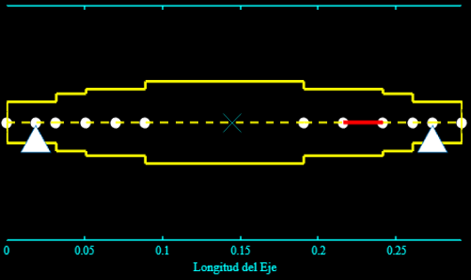 | 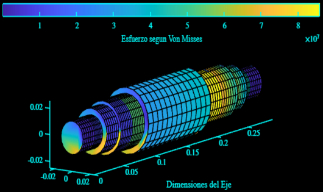 |

 

 Gracias a las diversas teorías abarcadas en los algoritmos de cálculo, es posible diseñar y optimizar una gran variedad de sistemas de transmisión de potencia mecánicos. 

 

| Análisis estático y dinámico del eje | Análisis de los ciclos de vida del eje |
|----------------------------------------------------------------------------------|---------------------------------------------------------------------------------|
| 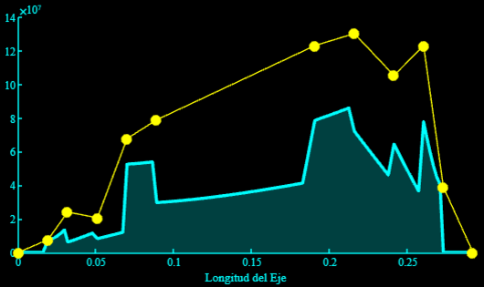 | 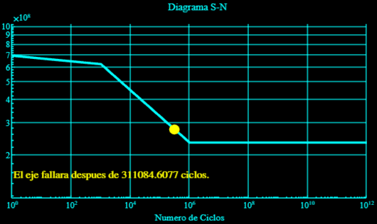 |

 

 No resulta necesario ser un profesional en ingeniería mecánica para poder utilizar esta aplicación, dado que, bajo una base teorica fundamental sobre elementos de transmisión de potencia mecánica, cualquier usuario esta en la capacidad de entender los resultados obtenidos y mejorar su diseño hasta alcanzar su objetivo, de manera rapida y precisa. 

 

| Análisis de la velocidad crítica del eje | Análisis de las deformaciones del eje |
|----------------------------------------------------------------------------------|---------------------------------------------------------------------------------|
| 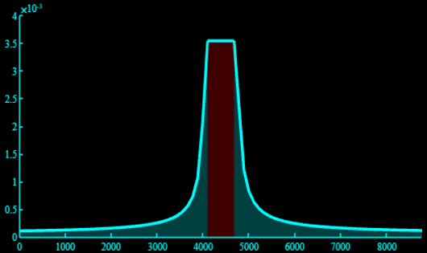 | 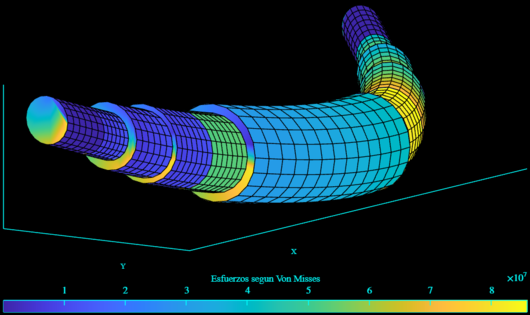 |

 

 Debido al tiempo y dedicación que se invirtio en el desarrollo de esta aplicación, es factible obtener los mismos resultados que se obtendrian con programas de diseño mas avanzados, pero sin tener que lidiar con los costos y la dificultad que conlleva utilizarlos. 

 

| Simulación en ANSYS                                                             | Simulación en PSTC                                                            |
|----------------------------------------------------------------------------------|---------------------------------------------------------------------------------|
|  | 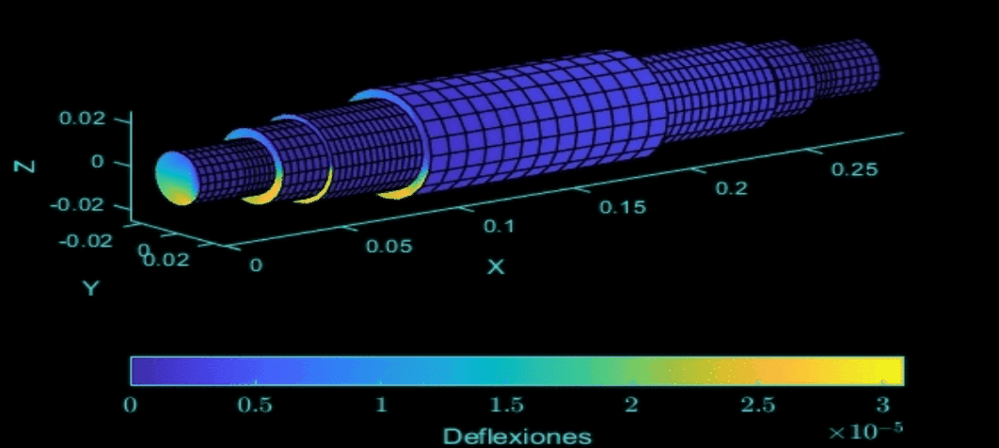 |

 

 En la actualidad, resulta de vital importancia saber usar programas de diseño estructural y de simulación, en el campo laboral de un ingeniero mecanico, no obstante, en la práctica se deja la teoría de lado y se salta al uso de dichos programas, debido a la complejidad que aparenta el método de los elementos finitos. Sin embargo, con la ayuda de un buen libro y empeño personal, es posible entender este tema a la perfección y crear programas a partir de este. 

 

| Simulación de una correa de transmisión | Simulación de un diente de engranaje                                                            |
|----------------------------------------------------------------------------------|---------------------------------------------------------------------------------|
|  |  |

 

## **5. Aplicaciones**

 Teniendo en cuenta la rapidez y la precisión en el diseño que permite lograr la aplicación desarrollada, es valido utilizarla en el ambito laboral profesional, personal y universitario. 

 

| Validación manual | Deformaciones en un eje de sección variable |
|:----:|:----:|
| 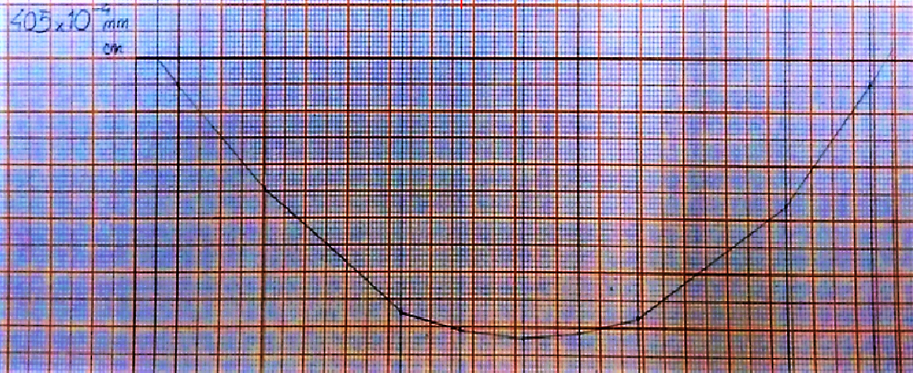 | 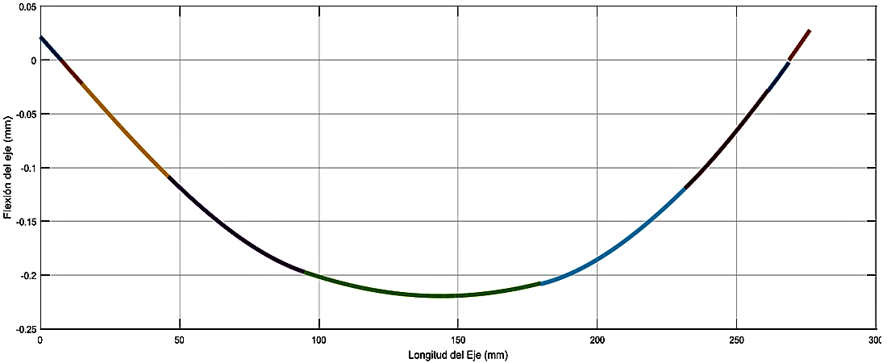 |

| Validación teórica | Validación del caso de estudio de Shigley |
|:----:|:----:|
| 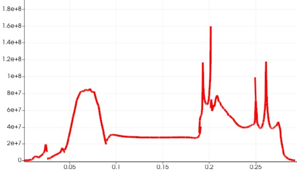 | 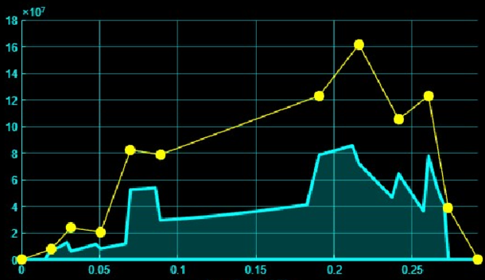 |

| Validación práctica | Rediseño de un sistema de potencia |
|:----:|:----:|
|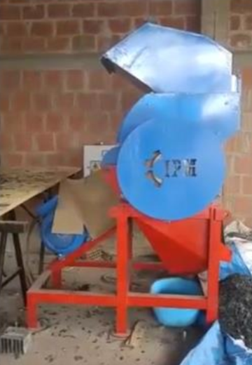 | 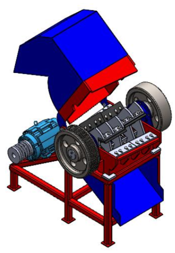 |
|  |  |

## **6. Comentarios finales**

 Este proyecto me todo mas tiempo del que pensaba, pero valio la pena terminarlo, dado que representa la union de mis dos grandes pasiones en el ambito intelectual: la ingeniería mecánica y la informática. Tengo entendido que es la primera tesis de este tipo en mi facultad, y espero que, dada la coyuntura actual, en el futuro mas estudiantes se animen a integrar a sus conocimientos como ingenieros, los relacionados al mundo de la programación. 

 

### **6.1 ¿Cómo acceder al aplicativo?**

+ La primero es ingresar al link del [repositorio de mi tesis](https://github.com/junior19a2000/Bachillerato/blob/main/README.md) (compartelo !).
+   
 Luego de revisarlo, buscar el módulo que se desea utilizar y hacer click en el logo de matlab online (esto te redireccionara a la pagina de inicio de matlab). Previamente a los pasos siguientes, es necesario contar con una cuenta de matlab online, la cual se crea muy facilmente a partir de cualquier correo electrónico (existen muchos tutoriales sobre esto). esto te permitira utilizar los servicios de matlab de manera gratuita y sin tener que instalar nada en tu equipo !. 
  
+ 
 Si es la primera vez ... en la pagina que te aparecera, debereas logearte con tus credenciales y posterior a ello, se te redireccionara a la version online de matalb. En ella visualizaras un cuadro que indica "Open file from repository". En este deberas hacer click en el cuadrito sobre riesgos (no existe ninguno en este caso) y luego seleccionar "Save and Open" (con este paso se creara una copia del proyecto en tu cuenta de matlab online). Luego, el módulo elegido aparecera en tu pantalla, listo para ser utilizado =).

  
 
Muestrame !
   
 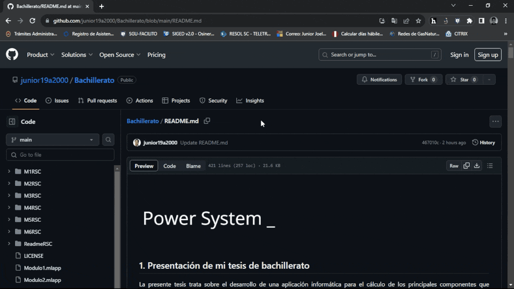 
 
  
+ 
 Si no es la primera vez ... en la pagina que te aparecera, unicamente tendras que dar click al boton que indica "Open Existing Copy" para poder utilizar el módulo seleccionado =). 

  
 
Muestrame !
   
  
 

 

### **6.2 ¿Cómo utilizarlo?**

 Si se requiere saber como utilizar cada módulo, simplemente haga click a la imagen respectiva del módulo a utilizar. Esta acción lo redireccionara a un video tutorial donde se muestra como se utiliza dicho módulo con un caso practico. 

  
Muestrame !

   
  

  
  

 

### **6.3 ¿Algo anda mal?**

 Si el aplicativo no funcionara correctamente, porfavor registrar el error mediante un video y enviarlo junto a una breve descripción al siguiente correo: junior19a2000@gmail.com. Estare gustoso de corregir cualquier problema que pudiese existir (se corregira para todos los usuarios, como una actualización y sin descargar o instalar nada nuevo !). El correo tambien sirve para críticas y comentarios :). 

